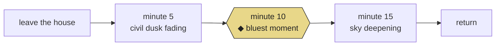

<!--
  PAPER.md — "On the Almanac as Interface"
  A commentary paper living inside the Bluest Hour repo.
  Reads as markdown on GitHub; renders ephemeris tables, ASCII figures,
  LaTeX, Mermaid, and alert blocks using only features GitHub ships.
-->

<div align="center">

###### <sub>BLUEST HOUR · WORKING PAPERS</sub> · <sub>VOL. I · NO. 001</sub> · <sub>MMXXVI</sub>

# On the Almanac as Interface

### *A commentary on* Bluest Hour — Almanac Edition,
### *and on the small form that holds it*

<sub>GODFREY, ILL. · 38.9556° N, 90.1868° W · JD 2461149.292</sub>

---

> *“In certain latitudes there comes a span of time approaching and following the summer solstice, some weeks in all, when the twilights turn long and blue.”*
>
> — Joan Didion, *Blue Nights*

---

</div>

&nbsp;

## Abstract

`Bluest Hour — Almanac Edition` is a single HTML file that tells its user, with astronomical precision, when to go outside. It is a wristwatch wearing the costume of a 19th-century almanac. This paper argues that the costume is not ornament: the almanac form is a specific, load-bearing choice that makes the app *intelligible* in a way a gradient-and-glass weather widget cannot be. We read the file at four levels — typographic, astronomical, computational, and phenomenological — and end with a short argument for what we call **ephemeral interfaces**: software written not against the clock but against the sky.

**Keywords** &nbsp;·&nbsp; almanac · ephemeris · twilight · Rayleigh scattering · single-file software · Didion · GoEmotions · field notes

&nbsp;

---

## <sub>§ I.</sub> &nbsp; The artifact

| | |
|---|---|
| **Title** | The Bluest Hour — Evening Ephemeris for Godfrey, Illinois |
| **Medium** | One `index.html` file · no build · no server |
| **Typeface** | IBM Plex Mono · Source Serif 4 |
| **Palette** | Paper white `oklch(96.5% .008 85)` · twilight blue `oklch(48% .14 248)` · almanac gold `oklch(62% .13 70)` |
| **Dependencies** | `fetch` → sunrisesunset.io · Transformers.js → [`MicahB/roberta-base-go_emotions`](https://huggingface.co/MicahB/roberta-base-go_emotions) (WASM, in-browser) |
| **Deployments** | [GitHub Pages](https://github.com/buildLittleWorlds/bluest-hour-almanac) · [Hugging Face Space](https://huggingface.co/spaces/profplate/bluest-hour-almanac) (static SDK)[^space] |
| **Lines of code** | ≈ 1,583 |
| **Reading time** | The length of one blue hour |

The app opens with a masthead — rule, double rule, italic epigraph — and closes with a colophon. In between it does five things: states a time, draws a curve, plots a year, explains itself, and waits for a field note. Each section is numbered with a small-caps roman numeral and separated by a hairline. There is no navigation.

&nbsp;

---

## <sub>§ II.</sub> &nbsp; Why the almanac

The prior version of Bluest Hour[^prior] used a vertical twilight gradient and glassmorphic cards — the default aesthetic of the consumer-weather genre. The almanac redesign is a genre shift. Consider what each form *claims*:

| form | claims to be | reader posture | time-sense |
|---|---|---|---|
| weather app | live, personal, ambient | glance | the next hour |
| almanac | annual, communal, recorded | *sit down* | the whole year |
| ephemeris | astronomical, impersonal, exact | calculate | any moment, any century |

An almanac asks you to regard the sky as something that has been happening for a long time, and will keep happening. It *flattens the user into an observer*. This is the right posture for a walk. A weather widget cannot do this, no matter how pretty the gradient, because it is shaped like a notification.

> [!NOTE]
> The almanac form is older than the clock and older than the app. Its earliest English exemplars predate the notion that a tool should "disappear into the hand." The almanac wants to be *on the table*.

&nbsp;

---

## <sub>§ III.</sub> &nbsp; The anatomy of a blue hour

Civil twilight ends when the sun sits **6°** below the horizon. Nautical twilight ends at **12°**. The window between — the "blue hour" in the strict sense — is roughly

$$
\Delta t_{\text{blue}} \;=\; \frac{6^{\circ}}{\dot h(\varphi, \delta, t)} \,,
$$

where $\dot h$ is the rate at which the sun's altitude drops below the horizon. Because $\dot h$ depends on the observer's latitude $\varphi$ and the sun's declination $\delta$, the blue hour is longer in summer and at high latitudes, shorter near the equinoxes, shortest near the equator. At Godfrey ($\varphi = 38.96°$ N) it swings between roughly 24 and 34 minutes across the year — a range of eleven minutes that is the entire animating argument of § III of the app.

```
 ┌──────────────────────────────────────────────────────────────┐
 │ Fig. 1 · Nautical-twilight duration at 38.96° N (minutes)    │
 ├──────────────────────────────────────────────────────────────┤
 │                                                              │
 │ 36 ┤                                                         │
 │    │                  ╭───╮                                  │
 │ 32 ┤               ╭──╯   ╰──╮                               │
 │    │            ╭──╯         ╰──╮                            │
 │ 28 ┤         ╭──╯     ◆today     ╰──╮                        │
 │    │      ╭──╯                      ╰──╮            ╭─       │
 │ 24 ┤──────╯                            ╰────────────╯        │
 │    │                                                         │
 │    └──┬────┬────┬────┬────┬────┬────┬────┬────┬────┬────┬──┬─│
 │       J    F    M    A    M    J    J    A    S    O    N  D │
 │                                                              │
 │ ▴ summer solstice, ≈34 min ·  ▿ winter solstice, ≈24 min     │
 └──────────────────────────────────────────────────────────────┘
```

The app draws this as a smoothed cosine, an approximation accurate to within a minute or two for mid-latitudes:

$$
T(d) \;\approx\; 29 \,+\, 5 \,\cos\!\left(\tfrac{2\pi(d-172)}{365}\right)\quad[\text{min}]
$$

It is worth dwelling on the fact that this is **the** piece of knowledge the app offers that a user could not get from a stock weather service. Sunset times are a commodity. A seasonal curve of nautical-twilight duration, localized to the observer's bluffs and tree-line, is not.

&nbsp;

---

## <sub>§ IV.</sub> &nbsp; The local offset Δ

Every almanac for an inland site must confess to a fudge factor. The published twilight times assume an ideal sea-level horizon; the observer at Godfrey has the 450-foot relief above the Mississippi, trees, river haze, and the slight eastward lean of the town itself. The app encodes this as a single tunable:

```
                  astronomical midpoint of dusk → nautical end
                                 │
                                 ▼
  ─── civil end ─────────────────●─────────── nautical end ───
                      ◀──── Δ ───┤
                                 │
                      ▼ predicted bluest moment ▼
  ──────────────────●────────────────────────────────────────
                    │
       walk start ─┤                      ├─ walk end
                    ◀═════ 20 min ═══════▶
```

<kbd>Δ = 35 min</kbd> is the current calibration. It is not an astronomical constant; it is the author's estimate, and one of the very few places in the app where the author is personally present. Everything else is computed. The offset is the signature.

> [!TIP]
> The correct value of Δ is, in principle, discoverable. A user could walk for a week with a pocket colorimeter and fit a curve. In practice, Δ is what it is because the author decided on a Tuesday in Godfrey that the light looked right thirty-five minutes before the textbook midpoint. This is fine. Almanacs have always been like this.

&nbsp;

---

## <sub>§ V.</sub> &nbsp; The walk as unit

The twenty-minute walk is the app's unit of time, the way a tablespoon is a recipe's unit of volume. It is:

- **Long enough** to leave the house and come back having been outdoors.
- **Short enough** that the whole window fits inside even December's twenty-four-minute blue hour.
- **Centered**, not frontloaded — the darkest minute is minute ten, which is when you want to be farthest from your door.

The choice to *center* rather than *begin-at* the blue hour is small and correct. It is what separates a tool from a reminder.



&nbsp;

---

## <sub>§ VI.</sub> &nbsp; The field note, and why GoEmotions

§ V of the app is a textarea. You type a line about the walk, press <kbd>Classify ▸</kbd>, and a RoBERTa model fine-tuned on the GoEmotions corpus[^goemotions] returns a distribution over twenty-eight affective labels — *admiration, amusement, annoyance, approval, caring, confusion, curiosity, desire, disappointment, disapproval, disgust, embarrassment, excitement, fear, gratitude, grief, joy, love, nervousness, optimism, pride, realization, relief, remorse, sadness, surprise, neutral* — and one residual.

This is an odd pairing. A 19th-century almanac form, fed a field note, answered by a 21st-century transformer running in WebAssembly in your browser. The pairing is not a joke. Both the almanac and the classifier are doing the same thing: **taking a continuous phenomenon and quantizing it into a vocabulary.**

<table>
<tr>
<th align="left">the almanac quantizes…</th>
<th align="left">…into</th>
</tr>
<tr>
<td>the continuous darkening of the sky</td>
<td>civil · nautical · astronomical</td>
</tr>
<tr>
<td>the continuous year</td>
<td>day 001 … day 365</td>
</tr>
<tr>
<td>the continuous moon</td>
<td>new · waxing crescent · first quarter · …</td>
</tr>
<tr>
<th align="left">the classifier quantizes…</th>
<th align="left">…into</th>
</tr>
<tr>
<td>"how was the light tonight?"</td>
<td>28 GoEmotions labels + neutral</td>
</tr>
</table>

The classifier is, read generously, *just another ephemeris*. It publishes a table of coordinates for an internal sky.

> [!IMPORTANT]
> The classifier is local. Nothing leaves the browser. This matters to the argument: the field note is not a data product but a private act of observation, the way a 19th-century observer wrote "sky clear, wind SW, stars out at 8:12" in a leather book no one would ever read.

&nbsp;

---

## <sub>§ VII.</sub> &nbsp; Typography as argument

The app is set in **Source Serif 4** at an optical size tuned per block (display at 48, body at 14), with **IBM Plex Mono** for everything numeric, axial, or administrative — times, coordinates, labels, legends. The split is not aesthetic. It is epistemic.

> Serif is for *what might be said* about tonight.
> Mono is for *what is measured* about tonight.

Every sentence you could argue with — the epigraph, the prose in §III, §IV, and the field-note placeholder — is set in serif. Every string that is computed — the ephemeris, the axis labels, the Julian date, the lat/lng — is set in mono. The optical sizing means the big "walk at 7:14 pm" is drawn with a fatter, more authoritative cut of Source Serif than the small prose beneath it; the caption above each figure is the same 10.5 px uppercase Plex as the masthead dateline, stitching the apparatus together.

There is one gesture that earns the word *beautiful*: the drop-cap at the start of § IV is colored in **twilight blue** — the only piece of accent color that lands on a letterform in the entire document.

&nbsp;

---

## <sub>§ VIII.</sub> &nbsp; A reading of the masthead

```
 ─────────────────────────────────────────────────────────────
   VOL. I — NO. 108                                          
   APRIL 18, 2026                 The Bluest Hour           
                                  An evening ephemeris       
                                  for Godfrey, Illinois      
 ─────────────────────────────────────────────────────────────
   LAT 38.9556°N · LNG 90.1868°W   JD 2461149.292   MOON waxing crescent, 4% · Δ +35m
 ─────────────────────────────────────────────────────────────
```

The masthead tells you six things, in the following order: what volume of what publication, the date, the title, the subtitle, the coordinates, the Julian date, the moon phase, and the local offset. That last item — **Δ +35m** — is the only piece of authorial opinion on the masthead, and it is hidden in plain sight among the astronomical constants. This is the move. The app smuggles its one aesthetic claim in as if it were a fact.

&nbsp;

---

## <sub>§ IX.</sub> &nbsp; Toward ephemeral interfaces

I'd like to propose a small category.

> **Ephemeral interface** &nbsp;*n.* &nbsp; A piece of software whose primary function is to *tell you the right moment to stop using it.* Its success is measured in seconds of attention yielded back to the world.

The Bluest Hour is an instance. Its figure of merit is the number of evenings on which its user closes the browser tab, puts on a coat, and walks outside at 7:14 pm. Every design choice in the app is legible once you take this framing seriously:

1. **No login** — because logins imply return visits, and the app wants you to return only once per day, around sunset.
2. **No notifications** — because notifications are for media that want to be glanced at; the blue hour is not for glancing.
3. **Paper / night mode** — because the user is, literally, about to go from a bright interior into a darkening exterior; the night mode is for the six minutes after you come back.
4. **A single file** — because an almanac is *a thing on a shelf*, and a shelf is exactly the right level of permanence for an object you consult once per day.
5. **Local inference** — because the field note is a private act and almanacs have always been slightly private objects.

The paper-weather-widget genre is optimized against the metric of engagement. The almanac genre is optimized against the metric of *having gone outside*. The two are not neutral alternatives; they are in direct competition for the same hour.

&nbsp;

---

## <sub>§ X.</sub> &nbsp; What's missing

In the spirit of field notes:

- [ ] **Portability.** The app is hard-coded to 38.9556° N, 90.1868° W. A single `?lat=...&lng=...` query would break the charm of a local paper, but a drop-down of partner sites — "Godfrey, Ill.; Point Reyes, Cal.; Rothiemurchus, Scotland" — would extend the almanac genre without dissolving it.
- [ ] **Archive.** The app renders *tonight*. There is no past. A field-note archive, stored in `localStorage`, would make the instrument accumulate, which is what almanacs do.
- [ ] **Weather.** Cloud cover collapses the blue hour into a flat gray. The app should know when not to recommend a walk.
- [ ] **Δ learning.** With a week of field notes and timestamps, the offset could be fit rather than guessed.
- [x] **Didion.** Already done, on the masthead. The correct citation.

&nbsp;

---

## <sub>§ XI.</sub> &nbsp; Closing

The Bluest Hour is a twelve-kilobyte polemic about what software for a place can be. Its argument is not primarily made in prose — the prose is brief and deferential — but in its *form*: a masthead, a rule, an ephemeris, a curve, a legend, a colophon. It argues that the right response to "when should I go outside tonight" is not a push notification but a small printed object that happens to run in a browser and happens to know, to the second, when the sun will be nine degrees below your horizon.

It is, in the most literal sense, a **reading** of the sky. The app is the reader. You, and the walk, are the readers of the reader.

<div align="center">

*Fin.*

</div>

&nbsp;

---

## Colophon

<table>
<tr>
<td>

**Typography**
&nbsp;
IBM Plex Mono, Source Serif 4

**Method**
&nbsp;
Read the source; walked around the block; walked around the block again

**Composed in**
&nbsp;
Plain Markdown, inside the repository it describes

</td>
<td>

**Astronomical data**
&nbsp;
sunrisesunset.io

**Inference**
&nbsp;
Transformers.js · RoBERTa · GoEmotions (in-browser, WASM)

**Deployment**
&nbsp;
GitHub Pages · Hugging Face Space (static SDK)

**Epigraph**
&nbsp;
Joan Didion, *Blue Nights* (2011)

</td>
<td align="right">

<sup>MMXXVI</sup>
&nbsp;
Godfrey, Illinois
&nbsp;
*No ads · no tracking*
&nbsp;
`git log --follow PAPER.md`

</td>
</tr>
</table>

&nbsp;

---

## Notes

[^prior]: [buildLittleWorlds/bluest-hour](https://github.com/buildLittleWorlds/bluest-hour), the twilight-gradient / glassmorphic variant from which the almanac edition forked. Both are preserved; neither deprecates the other.

[^goemotions]: Demszky et al., *GoEmotions: A Dataset of Fine-Grained Emotions* (ACL 2020). The twenty-eight-label schema is the largest fine-grained affective taxonomy in wide circulation, and therefore the closest thing the app has to a Linnaean system for inner weather. The port used here is [`MicahB/roberta-base-go_emotions`](https://huggingface.co/MicahB/roberta-base-go_emotions), a Transformers.js build of SamLowe's ONNX export of the RoBERTa-base classifier trained on GoEmotions. It replaced an earlier DistilBERT-SST-2 classifier that could only answer positive/negative — a binary too coarse for the "inner weather" of a walk.

[^space]: The Hugging Face deployment is a *static* Space — no Python, no server inference. The same `index.html`, the same in-browser WASM model, a second shelf. This matters to the argument of § IX: a shelf on the Hub is a different shelf from a shelf on GitHub Pages (the Hub indexes *models*, not pages), but it is still a shelf. The almanac does not care which room of the library it is placed in, only that it is placed flat and consulted once.
